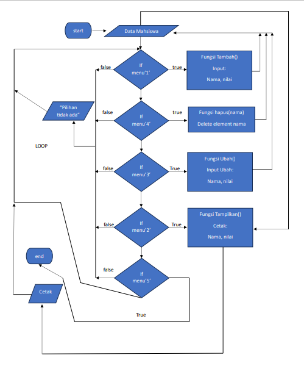
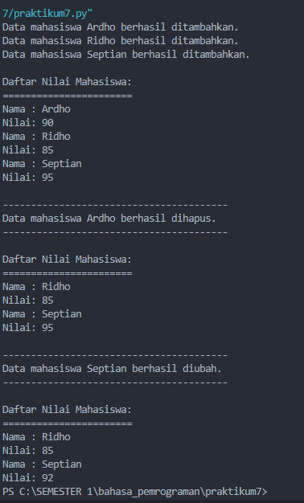

| Nama                    |  **NIM**           | **Kelas**      |
|:------------------------|:------------------:|---------------:|
|**Ahmad Ridho Septian**  | **312310447**      |  **TI.23.A5**  |
# Latihan 1

```python
import math
my_list = [1, 5, 4, 6, 8, 11, 3, 12]

a = lambda x: x**2
b = lambda x, y: math.sqrt(x**2 + y**2)
c = lambda *args: sum(args) / len(args)
d = lambda s: "".join(set(s))
```

# Praktikum 7

### flowchart



### code

```python
data_mahasiswa = []

def tambah(nama, nilai):
    data_mahasiswa.append({'nama': nama, 'nilai': nilai})
    print(f"Data mahasiswa {nama} berhasil ditambahkan.")

def tampilkan():
    if not data_mahasiswa:
        print("Tidak ada data mahasiswa.")
    else:
        print("Daftar Nilai Mahasiswa:")
        print("="*23)
        for mahasiswa in data_mahasiswa:
           print(f"Nama : {mahasiswa['nama']}")
           print(f"Nilai: {mahasiswa['nilai']}")

def hapus(nama):
    for mahasiswa in data_mahasiswa:
        if mahasiswa['nama'] == nama:
            data_mahasiswa.remove(mahasiswa)
            print(f"Data mahasiswa {nama} berhasil dihapus.")
            return
    print(f"Data mahasiswa {nama} tidak ditemukan.")

def ubah(nama, nilai_baru):
    for mahasiswa in data_mahasiswa:
        if mahasiswa['nama'] == nama:
            mahasiswa['nilai'] = nilai_baru
            print(f"Data mahasiswa {nama} berhasil diubah.")
            return
    print(f"Data mahasiswa {nama} tidak ditemukan.")


tambah("Ardho", 90)
tambah("Ridho", 85)
tambah("Septian", 95)
print("")

tampilkan()

print("")
print("-"*40)
hapus("Ardho")
print("-"*40)
print("")

tampilkan()
print("")
print("-"*40)
ubah("Septian", 92)
print("-"*40)
print("")

tampilkan()

```

### output



## Penjelasan

#### 1. Inisialisasi Variabel:

```python
data_mahasiswa = []
```

- 'data_mahasiswa' adalah sebuah list yang digunakan untuk menyimpan data mahasiswa. Awalnya, list ini kosong.

#### 2. Fungsi Tambah

```python
def tambah(nama, nilai):
    data_mahasiswa.append({'nama': nama, 'nilai': nilai})
    print(f"Data mahasiswa {nama} berhasil ditambahkan.")
```

- Fungsi ini menerima dua parameter, yaitu 'nama' dan 'nilai'.
- Menambahkan data mahasiswa baru ke data_mahasiswa dalam bentuk dictionary.
- Mencetak pesan konfirmasi bahwa data mahasiswa telah berhasil ditambahkan.

#### 3. Fungsi Tampilkan

```python
def tampilkan():
    if not data_mahasiswa:
        print("Tidak ada data mahasiswa.")
    else:
        print("Daftar Nilai Mahasiswa:")
        for mahasiswa in data_mahasiswa:
            print(f"Nama: {mahasiswa['nama']}, Nilai: {mahasiswa['nilai']}")
```

- Fungsi ini menampilkan daftar nilai mahasiswa.
- Memeriksa apakah 'data_mahasiswa, kosong. Jika iya, mencetak pesan bahwa tidak ada data mahasiswa. Jika tidak, mencetak daftar nilai mahasiswa.

#### 4. Fungsi Hapus

```python
def hapus(nama):
    for mahasiswa in data_mahasiswa:
        if mahasiswa['nama'] == nama:
            data_mahasiswa.remove(mahasiswa)
            print(f"Data mahasiswa {nama} berhasil dihapus.")
            return
    print(f"Data mahasiswa {nama} tidak ditemukan.")
```

- Fungsi ini menerima parameter "nama" dan mencoba menghapus data mahasiswa dengan nama tersebut.
- Jika ditemukan, data tersebut dihapus dari 'data_mahasiswa'. Jika tidak, mencetak pesan bahwa data mahasiswa tidak ditemukan.

#### 5. Fungsi Ubah

```python
def ubah(nama, nilai_baru):
    for mahasiswa in data_mahasiswa:
        if mahasiswa['nama'] == nama:
            mahasiswa['nilai'] = nilai_baru
            print(f"Data mahasiswa {nama} berhasil diubah.")
            return
    print(f"Data mahasiswa {nama} tidak ditemukan.")
```

- Fungsi ini menerima parameter 'nama' dan 'nilai_baru' untuk mengubah nilai mahasiswa.
- Jika mahasiswa dengan nama tersebut ditemukan, nilai mahasiswa diubah. Jika tidak, mencetak pesan bahwa data mahasiswa tidak ditemukan.

#### 6. Pemanggilan Fungsi

```python
tambah("Ardho", 90)
tambah("Ridho", 85)
tambah("Septian", 95)
print("")

tampilkan()

print("")
print("-"*40)
hapus("Ardho")
print("-"*40)
print("")

tampilkan()
print("")
print("-"*40)
ubah("Septian", 92)
print("-"*40)
print("")

tampilkan()
```

- Pemanggilan fungsi untuk menambahkan tiga mahasiswa, menampilkan daftar mahasiswa, menghapus mahasiswa "Ardho", menampilkan daftar mahasiswa lagi, mengubah nilai mahasiswa "Septian", dan terakhir menampilkan daftar mahasiswa setelah perubahan.
